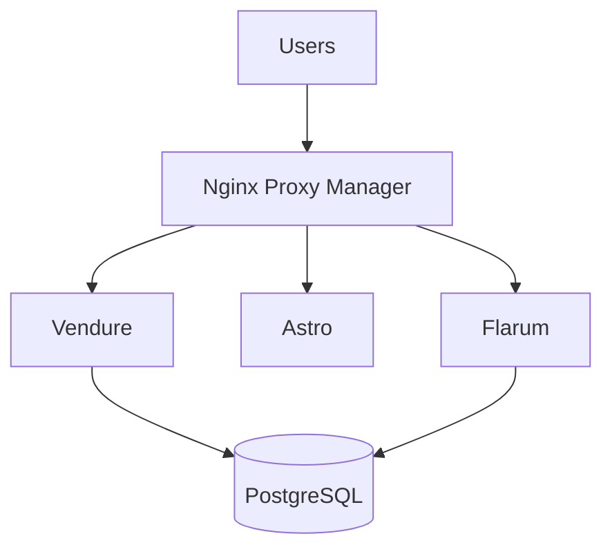

# server011526-debian-ecom

This is a Terraform project for my Debian-based ecommerce project, started approximately Jan 15, 2025.

It has evolved from my past TF project "server020325-debianNpm". 

## Use of ClaudeAI in this project:

**Evolution of documentation of past project:**
I used ClaudeAI (via browser) to take that project's code (tf, yml), notes & documentation and organize it into a fresh, clear, concise set of documentation.  
(That project became a bit cluttered and disorganized as I iterated on it.  One problem I faced which threw me for a loop was... I had worked on it from publc libraries-- which blocked ssh access.  It took me some time to realize that, and it distracted me a bit. I was also improving my shell automation knowledge & skills while iterating on the project's setup automation steps.  As a result, I didn't put as much focus into keeping my notes clean.)  ClaudeAI proved quite useful for organizing and clarifying my own human-written documentation.

**Project analysis and improvement suggestions:** I also use ClaudeAI to analyze my project and recommend improvements. In the process, Claude introduces me to new knowledge to learn.  

## Security Notes

This repository contains infrastructure-as-code for a linux server hosting a small business e-commerce marketplace. All sensitive information (tokens, keys, passwords, IP addresses) is managed via 1Password and environment variables - nothing sensitive is committed to this repository.

The server implements defense-in-depth: DigitalOcean cloud firewall restricts traffic to ports 80/443/22, UFW provides host-level firewall rules, fail2ban automatically blocks IPs after 3 failed SSH attempts, and SSH is configured for key-only authentication with password login disabled. Detailed security implementation is documented in `docs/server-security-hardening-guide.md`.

**DevOps Overview:**
- Secrets management: 1Password CLI integration
- Infrastructure: Terraform for reproducible deployments
- Automation: GitHub Actions for CI/CD (SSH keys stored in repository secrets)
- Security: Multi-layered defense (cloud firewall, UFW, fail2ban, SSH key-only auth)

## Architecture

This server runs a containerized web application stack on Debian 12. 

- Nginx Proxy Manager handles SSL certificates and routes traffic to three applications: 
- Vendure (Node.js eCommerce platform)
- Astro (static site generator for marketing content)
- Flarum (PHP forum software). 

All applications connect to a shared DigitalOcean managed PostgreSQL database, while static assets are stored in DigitalOcean Spaces object storage.

---

## Cost Breakdown

Monthly infrastructure: $44 total. The droplet ($24/mo) provides 2 vCPU, 4GB RAM, and 80GB SSD running all application containers. Managed PostgreSQL ($15/mo) handles automated backups, point-in-time recovery, and eliminates database maintenance. Object storage ($5/mo) provides 250GB for images and static files with 1TB monthly transfer.

---

## Scaling Strategy

The current single-droplet architecture can handle moderate traffic loads: ($24/mo) provides 2 vCPU, 4GB RAM, and 80GB SSD. 

When resource constraints appear (sustained >80% RAM, slow page loads), the next step is vertical scaling to a $48/mo droplet with 4 vCPU and 8GB RAM. Because the database and storage are already separate managed services, migration only involves spinning up a new droplet, pointing containers to the existing database, and switching DNS - no data migration required.

---

## Monitoring

Server health is monitored through DigitalOcean's built-in metrics dashboard (CPU, RAM, disk, bandwidth). Application logs are accessible via `docker compose logs` for debugging. External uptime monitoring via UptimeRobot (free tier) checks site availability every 5 minutes and sends email alerts on downtime. Weekly manual health checks include reviewing logs for errors and checking disk space usage.

---